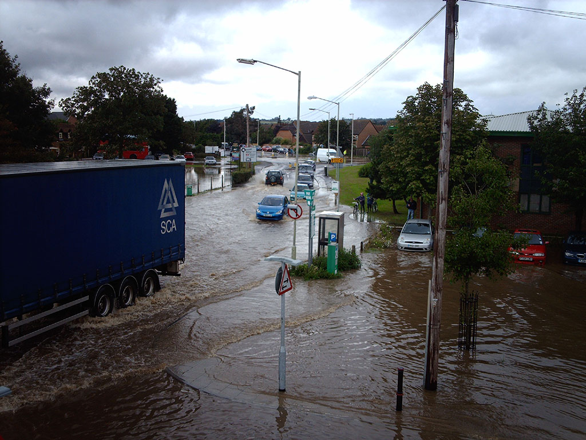
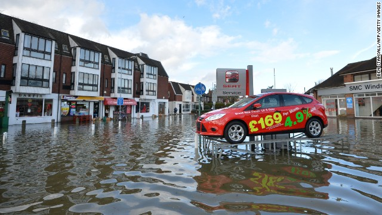
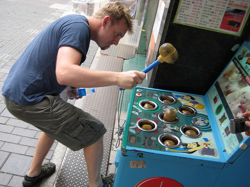

!SLIDE 
# Puppet and the snowflakes #

!SLIDE
#What is a snowflake?

!SLIDE center 

!SLIDE center 

!SLIDE
#A snowflake...

!SLIDE 
#is either a single ice crystal or an aggregation of ice crystals which falls through the Earth's atmosphere 

!SLIDE 
#each is nearly unique in structure

!SLIDE 
#a bit like servers

!SLIDE 
#more like developer machines 

!SLIDE
#similarly formed

!SLIDE
#what's good?

!SLIDE
#empowerment, choice, agility

!SLIDE
#what's bad?

!SLIDE
#inconsistent (Robocode)

!SLIDE
#multiple projects

!SLIDE center

!SLIDE
#fragile

!SLIDE
#take a while to build 

!SLIDE
#take even longer to rebuild 

!SLIDE
#is it ever the same?

!SLIDE
#a bit like coding without tests...

!SLIDE bullets incremental

# Bullet Points #

* first point
* second point
* third point
