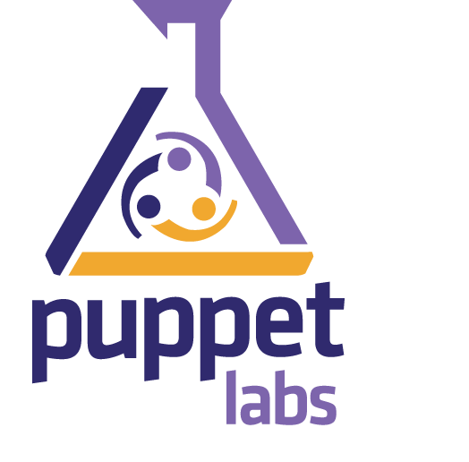

!SLIDE center

!SLIDE
# Virtual machine provisioning tool

!SLIDE
#vagrant up | halt | destroy 

!SLIDE 
#Written in Ruby

!SLIDE
#Provider plugins

!SLIDE 
#VirtualBox out of the box

!SLIDE
#AWS

!SLIDE
#VMWare Workstation / Fusion (Commercial)

!SLIDE center

!SLIDE
#Work in progress

!SLIDE
#What is Docker?

!SLIDE
#an extension to LXC

!SLIDE
#Really important as

!SLIDE
#It isolates fairly well

!SLIDE
#It runs on bare metal metal

!SLIDE
#But

!SLIDE
#Doesn't work on Windows

!SLIDE
#Relies on VirtualBox shim for OS X 

!SLIDE
#Back to Vagrant..

!SLIDE
#Composition

!SLIDE
#Base OS images

!SLIDE
#Configuration (Memory, CPU, Port Forwarding)

!SLIDE
#Bootstraps software provisioning

!SLIDE
[https://github.com/paulspencerwilliams/vagrant-neo4j/blob/master/Vagrantfile](https://github.com/paulspencerwilliams/vagrant-neo4j/blob/master/Vagrantfile)

!SLIDE
#3 software provisioning options 

!SLIDE
#Imperative shell scripts

!SLIDE
#Easy (not simple)

!SLIDE
[http://www.infoq.com/presentations/Simple-Made-Easy](http://www.infoq.com/presentations/Simple-Made-Easy)

!SLIDE
#bash, zsh, powerscript 

!SLIDE
#apt-get vs yum vs homebrew

!SLIDE
#Chef

!SLIDE center
 

!SLIDE
#Declaratively & idempotently abstracts
* apt-get
* yum
* homebrew
* chocolateynuget (nuget)

!SLIDE
#Declarative was hard
similar to functional

!SLIDE
#Idempotent was even harder

!SLIDE 
#Here's one I prepared earlier...

!SLIDE
[http://en.wikipedia.org/wiki/Six_Degrees_of_Kevin_Bacon](http://en.wikipedia.org/wiki/Six_Degrees_of_Kevin_Bacon)

!SLIDE
#I bought the wrong computer 
#:(

!SLIDE 
#I hack with lots of things 

!SLIDE
[https://github.com/paulspencerwilliams/six-degrees-clj] (https://github.com/paulspencerwilliams/six-degrees-clj)

!SLIDE
[https://github.com/paulspencerwilliams/vagrant-neo4j] (https://github.com/paulspencerwilliams/vagrant-neo4j)

!SLIDE
[https://github.com/paulspencerwilliams/vagrant-clojure]( https://github.com/paulspencerwilliams/vagrant-clojure)

!SLIDE
#Findings...

!SLIDE
#Declarative is hard

!SLIDE
#Idempotent is even harder

!SLIDE
#I now need to learn librarian-puppet / r10k

!SLIDE
#Infrastructure as code is great

!SLIDE
#Questions? 

