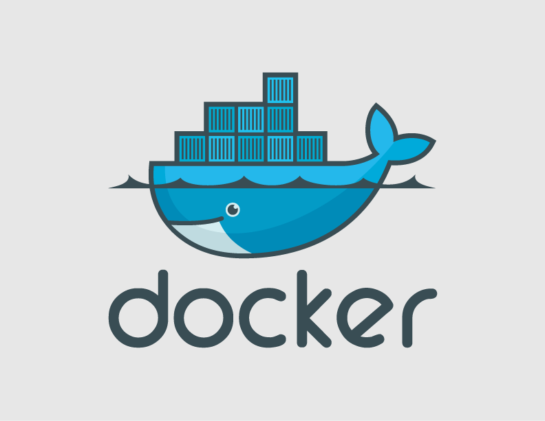

!SLIDE 

!SLIDE
# Virtual machine provisioning tool

!SLIDE
#vagrant up | halt | destroy 

!SLIDE 
#Written in Ruby

!SLIDE
#Provider plugins

!SLIDE 
#VirtualBox out of the box

!SLIDE
#AWS

!SLIDE
#VMWare Workstation / Fusion (Commercial)

!SLIDE center

!SLIDE
#Work in progress

!SLIDE
#What is Docker?

!SLIDE
#an extension to LXC

!SLIDE
#Really important as

!SLIDE
#It isolates fairly well

!SLIDE
#It runs on bare metal metal

!SLIDE
#But

!SLIDE
#Doesn't work on Windows

!SLIDE
#Relies on VirtualBox shim for OS X 

!SLIDE
#Back to Vagrant..

!SLIDE
#Composition

!SLIDE
#Base OS images

!SLIDE
#Configuration (Memory, CPU, Port Forwarding)

!SLIDE
#Bootstraps software provisioning

!SLIDE
#3 options

!SLIDE
#Imperative shell scripts

!SLIDE
#Easy (not simple)

!SLIDE
[http://www.infoq.com/presentations/Simple-Made-Easy](http://www.infoq.com/presentations/Simple-Made-Easy)

!SLIDE
#apt-get vs yum vs homebrew

!SLIDE
#Chef

!SLIDE center
 

!SLIDE
#Declaratively & thus idempotently abstracts
* apt-get
* yum
* homebrew
* chocolateynuget (nuget)

!SLIDE 
#PROVE IT!!

!SLIDE
#I bought the wrong computer 
#:(

!SLIDE 
#I hack with lots of things 

!SLIDE
[http://en.wikipedia.org/wiki/Six_Degrees_of_Kevin_Bacon](http://en.wikipedia.org/wiki/Six_Degrees_of_Kevin_Bacon)

!SLIDE
#Questions? 

!SLIDE
#Sketchnote

